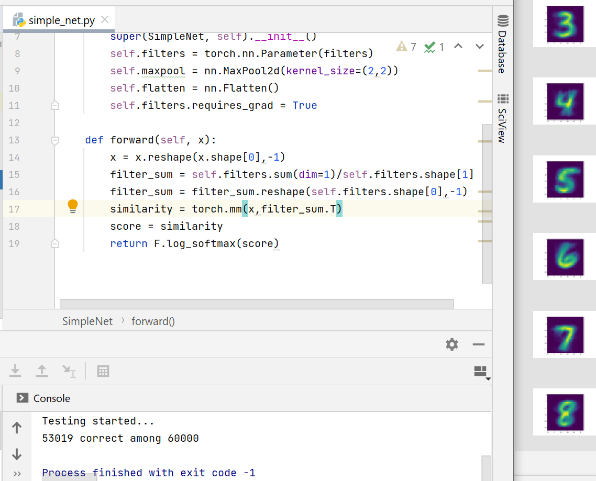

**Who am I?**

I am not a neural network. 

I am a machine who recognizes handwritten digits. 

I update my classification filters with a cumulative mean approach as I see a training examples.

My accuracy is 77+% at this moment - but don't underestimate me. I have novelty(or maybe obsolescence :-/).

**Install**

pip install -r requirements.txt

**Run**

Run main.py

**Future Work**

Apply DSC Image similarity

Try with 1 and different number of filters and see if really multiple filters help

Try with shared-grid filters (like in CNN)

**Screenshot**

